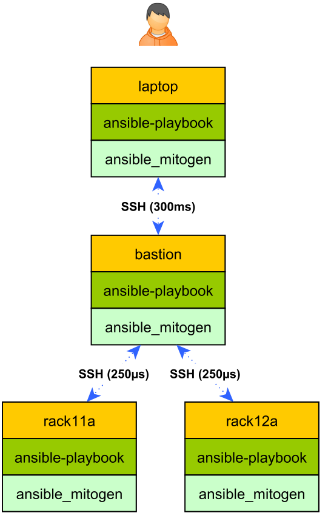
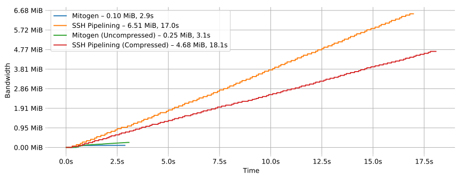
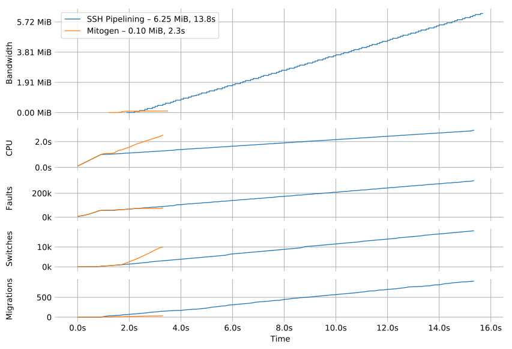
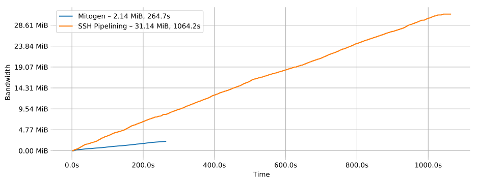
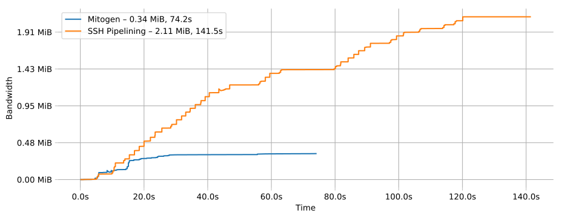

.. _ansible_detailed:

Mitogen for Ansible
===================

**Mitogen for Ansible** is a completely redesigned UNIX connection layer and
module runtime for `Ansible`_. Requiring minimal configuration changes, it
updates Ansible's slow and wasteful shell-centric implementation with
pure-Python equivalents, invoked via highly efficient remote procedure calls to
persistent interpreters tunnelled over SSH. No changes are required to target
hosts.

The extension is considered stable and real-world use is encouraged.

.. _Ansible: https://www.ansible.com/

.. _Bug reports: https://github.com/mitogen-hq/mitogen/issues/new/choose

Overview
--------

**Expect a 1.25x - 7x speedup** and a **CPU usage reduction of at least 2x**,
depending on network conditions, modules executed, and time already spent by
targets on useful work. Mitogen cannot improve a module once it is executing,
it can only ensure the module executes as quickly as possible.

* **One connection is used per target**, in addition to one sudo invocation per
  user account. This is much better than SSH multiplexing combined with
  pipelining, as significant state can be maintained in RAM between steps, and
  system logs aren't spammed with repeat authentication events.

* **A single network roundtrip is used** to execute a step whose code already
  exists in RAM on the target. Eliminating multiplexed SSH channel creation
  saves 4 ms runtime per 1 ms of network latency for every playbook step.

* **Processes are aggressively reused**, avoiding the cost of invoking Python
  and recompiling imports, saving 300-800 ms for every playbook step.

* Code is ephemerally cached in RAM, **reducing bandwidth usage by an order
  of magnitude** compared to SSH pipelining, with around 5x fewer frames
  traversing the network in a typical run.

* **Fewer writes to the target filesystem occur**. In typical configurations,
  Ansible repeatedly rewrites and extracts ZIP files to multiple temporary
  directories on the target. Security issues relating to temporary files in
  cross-account scenarios are entirely avoided.

The effect is most potent on playbooks that execute many **short-lived
actions**, where Ansible's overhead dominates the cost of the operation, for
example when executing large ``with_items`` loops to run simple commands or
write files.

Installation
------------

1. Review :ref:`noteworthy_differences`.
2. Download and extract |mitogen_url|.
3. Modify ``ansible.cfg``:

   .. parsed-literal::

        [defaults]
        strategy_plugins = /path/to/mitogen-|mitogen_version|/ansible_mitogen/plugins/strategy
        strategy = mitogen_linear

   The ``strategy`` key is optional. If omitted, the
   ``ANSIBLE_STRATEGY=mitogen_linear`` environment variable can be set on a
   per-run basis. Like ``mitogen_linear``, the ``mitogen_free`` and
   ``mitogen_host_pinned`` strategies exists to mimic the ``free`` and
   ``host_pinned`` strategies.

4.

   .. raw:: html

    <form action="https://networkgenomics.com/save-email/" method="post" id="emailform">
        <input type=hidden name="list_name" value="mitogen-announce">

        Get notified of new releases and important fixes.

        

        <input type="email" placeholder="E-mail Address" name="email" style="font-size: 105%;"> 
        <input name="captcha_1" placeholder="Captcha" style="width: 10ex;">
        
        <a class="captcha-refresh" href="#">&#x21bb</a>

        <button type="submit" style="font-size: 105%;">
            Subscribe
        </button>

        

        

            Thanks!
        

        

    </form>

Demo
~~~~

This demonstrates Ansible running a subset of the Mitogen integration tests
concurrent to an equivalent run using the extension.

.. raw:: html

    <iframe src="https://player.vimeo.com/video/283272293?title=0&byline=0&portrait=0" width="720" height="439" frameborder="0" webkitallowfullscreen mozallowfullscreen allowfullscreen></iframe>

Testimonials
~~~~~~~~~~~~

* "With mitogen **my playbook runtime went from 45 minutes to just under 3
  minutes**. Awesome work!"

* "The runtime was reduced from **1.5 hours on 4 servers to just under 3
  minutes**. Thanks!"

* "Oh, performance improvement using Mitogen is *huge*. As mentioned before,
  running with Mitogen enables takes 7m36 (give or take a few seconds). Without
  Mitogen, the same run takes 19m49! **I'm not even deploying without Mitogen
  anymore** :)"

* "**Works like a charm**, thank you for your quick response"

* "I tried it out. **He is not kidding about the speed increase**."

* "I don't know what kind of dark magic @dmw_83 has done, but his Mitogen
  strategy took Clojars' Ansible runs from **14 minutes to 2 minutes**. I still
  can't quite believe it."

* "Enabling the mitogen plugin in ansible feels like switching from floppy to SSD"

.. _noteworthy_differences:

Noteworthy Differences
----------------------

* Mitogen 0.2.x supports Ansible 2.3-2.9; with Python 2.6, 2.7, or 3.6.
  Mitogen 0.3.1+ supports

    - Ansible 2.10, 3, and 4; with Python 2.7, or 3.6-3.11
    - Ansible 5 and 6; with Python 3.8-3.11

  Verify your installation is running one of these versions by checking
  ``ansible --version`` output.

* The ``raw`` action executes as a regular Mitogen connection, which requires
  Python on the target, precluding its use for installing Python. This will be
  addressed in a future release. For now, simply mix Mitogen and vanilla
  Ansible strategies:

  .. code-block:: yaml

    - hosts: web-servers
      strategy: linear
      tasks:
      - name: Install Python if necessary.
        raw: test -e /usr/bin/python || apt install -y python-minimal

    - hosts: web-servers
      strategy: mitogen_linear
      roles:
      - nginx
      - initech_app
      - y2k_fix

* Ansible `become plugins
  <https://docs.ansible.com/ansible/latest/plugins/become.html>`_ are not yet
  supported.

* The ``doas``, ``su`` and ``sudo`` become methods are available. File bugs to
  register interest in more.

* The ``sudo`` comands executed differ slightly compared to Ansible. In some
  cases where the target has a ``sudo`` configuration that restricts the exact
  commands allowed to run, it may be necessary to add a ``sudoers`` rule like:

  ::

       your_ssh_username = (ALL) NOPASSWD:/usr/bin/python -c*

* The :ans:conn:`~buildah`, :ans:conn:`~docker`, :ans:conn:`~jail`,
  :ans:conn:`~kubectl`, :ans:conn:`~local`, :ans:conn:`~lxd`,
  :ans:conn:`~podman`, & :ans:conn:`~ssh` connection types are supported; also
  Mitogen-specific :ref:`mitogen_doas <doas>`, :ref:`machinectl <machinectl>`,
  :ref:`mitogen_su <su>`, :ref:`mitogen_sudo <sudo>`, and :ref:`setns <setns>`
  types. File bugs to register interest in others.

* Actions are single-threaded for each `(host, user account)` combination,
  including actions that execute on the local machine. Playbooks may experience
  slowdown compared to vanilla Ansible if they employ long-running
  ``local_action`` or ``delegate_to`` tasks delegating many target hosts to a
  single machine and user account.

  Ansible usually permits up to ``forks`` simultaneous local actions. Any
  long-running local actions that execute for every target will experience
  artificial serialization, causing slowdown equivalent to `task_duration *
  num_targets`. This will be addressed soon.

* The Ansible 2.7 :ans:mod:`reboot` may require a ``pre_reboot_delay`` on
  systemd hosts, as insufficient time exists for the reboot command's exit
  status to be reported before necessary processes are torn down.

* On OS X when a SSH password is specified and the default connection type of
  :ans:conn:`~smart` is used, Ansible may select the :ans:conn:`paramiko_ssh`
  rather than Mitogen. If you specify a password on OS X, ensure ``connection:
  ssh`` appears in your playbook, ``ansible.cfg``, or as ``-c ssh`` on the
  command-line.

* Ansible permits up to ``forks`` connections to be setup in parallel, whereas
  in Mitogen this is handled by a fixed-size thread pool. Up to 32 connections
  may be established in parallel by default, this can be modified by setting
  the ``MITOGEN_POOL_SIZE`` environment variable.

* Performance does not scale cleanly with target count. This will improve over
  time.

* Performance on Python 3 is significantly worse than on Python 2. While this
  has not yet been investigated, at least some of the regression appears to be
  part of the core library, and should therefore be straightforward to fix as
  part of 0.2.x.

..
    * SSH and ``become`` are treated distinctly when applying timeouts, and
    timeouts apply up to the point when the new interpreter is ready to accept
    messages. Ansible has two timeouts: ``ConnectTimeout`` for SSH, applying up
    to when authentication completes, and a separate parallel timeout up to
    when ``become`` authentication completes.
    For busy targets, Ansible may successfully execute a module where Mitogen
    would fail without increasing the timeout. For sick targets, Ansible may
    hang indefinitely after authentication without executing a command, for
    example due to a stuck filesystem IO appearing in ``$HOME/.profile``.

..
    * "Module Replacer" style modules are not supported. These rarely appear in
    practice, and light web searches failed to reveal many examples of them.

..
    * The ``ansible_python_interpreter`` variable is parsed using a restrictive
      :mod:`shell-like <shlex>` syntax, permitting values such as ``/usr/bin/env
      FOO=bar python`` or ``source /opt/rh/rh-python36/enable && python``, which
      occur in practice. Jinja2 templating is also supported for complex task-level
      interpreter settings. Ansible `documents this
      <https://docs.ansible.com/ansible/latest/user_guide/intro_inventory.html#ansible-python-interpreter>`_
      as an absolute path, however the implementation passes it unquoted through
      the shell, permitting arbitrary code to be injected.

..
    * Configurations will break that rely on the `hashbang argument splitting
      behaviour <https://github.com/ansible/ansible/issues/15635>`_ of the
      ``ansible_python_interpreter`` setting, contrary to the Ansible
      documentation. This will be addressed in a future 0.2 release.

New Features & Notes
--------------------

Connection Delegation
~~~~~~~~~~~~~~~~~~~~~

Included is a preview of **Connection Delegation**, a Mitogen-specific
implementation of `stackable connection plug-ins`_. This enables connections
via a bastion, or container connections delegated via their host machine, where
reaching the host may entail further delegation.

.. _Stackable connection plug-ins: https://github.com/ansible/proposals/issues/25

Unlike with SSH forwarding Ansible has complete visibility of the final
topology, declarative configuration via static/dynamic inventory is possible,
and data can be cached and re-served, and code executed on every intermediary.

For example when targeting Docker containers on a remote machine, each module
need only be uploaded once for the first task and container that requires it,
then cached and served from the SSH account for every future task in any
container.

.. raw:: html

    

.. caution::

    Connection delegation is a work in progress, bug reports are welcome.

    * Delegated connection setup is single-threaded; only one connection can be
      constructed in parallel per intermediary.

    * Inferring the configuration of intermediaries may be buggy, manifesting
      as duplicate connections between hops, due to not perfectly replicating
      the configuration Ansible would normally use for the intermediary.

    * Intermediary machines cannot use login and become passwords that were
      supplied to Ansible interactively. If an intermediary requires a
      password, it must be supplied via ``ansible_ssh_pass``,
      ``ansible_password``, or ``ansible_become_pass`` inventory variables.

    * Automatic tunnelling of SSH-dependent actions, such as the
      ``synchronize`` module, is not yet supported. This will be addressed in a
      future release.

To enable connection delegation, set ``mitogen_via=<inventory name>`` on the
command line, or as host and group variables.

.. code-block:: ini

    # Docker container on web1.dc1 is reachable via web1.dc1.
    [app-containers.web1.dc1]
    app1.web1.dc1 ansible_host=app1 ansible_connection=docker mitogen_via=web1.dc1

    # Web servers in DC1 are reachable via bastion.dc1
    [dc1]
    web1.dc1
    web2.dc1
    web3.dc1

    [dc1:vars]
    mitogen_via = bastion.dc1

    # Web servers in DC2 are reachable via bastion.dc2
    [dc2]
    web1.dc2
    web2.dc2
    web3.dc2

    [dc2:vars]
    mitogen_via = bastion.dc2

    # Prod bastions are reachable via a magic account on a
    # corporate network gateway.
    [bastions]
    bastion.dc1 mitogen_via=prod-ssh-access@corp-gateway.internal
    bastion.dc2 mitogen_via=prod-ssh-access@corp-gateway.internal

    [corp-gateway]
    corp-gateway.internal

File Transfer
~~~~~~~~~~~~~

Normally :linux:man1:`sftp` or :linux:man1:`scp` are used to copy files by the
:ans:mod:`~assemble`, :ans:mod:`~aws_s3`, :ans:mod:`~copy`, :ans:mod:`~patch`,
:ans:mod:`~script`, :ans:mod:`~template`, :ans:mod:`~unarchive`, and
:ans:mod:`~uri` actions, or when uploading modules with pipelining disabled.
With Mitogen copies are implemented natively using the same interpreters,
connection tree, and routed message bus that carries RPCs.

This permits direct streaming between endpoints regardless of execution
environment, without necessitating temporary copies in intermediary accounts or
machines, for example when ``become`` is active, or in the presence of
connection delegation. It also avoids the need to securely share temporary
files between accounts and machines.

As the implementation is self-contained, it is simple to make improvements like
prioritizing transfers, supporting resume, or displaying progress bars.

Safety
^^^^^^

Transfers proceed to a hidden file in the destination directory, with content
and metadata synced using :linux:man2:`fsync` prior to rename over any existing
file. This ensures the file remains consistent at all times, in the event of a
crash, or when overlapping `ansible-playbook` runs deploy differing file
contents.

The :linux:man1:`sftp` and :linux:man1:`scp` tools may cause undetected data
corruption in the form of truncated files, or files containing intermingled
data segments from overlapping runs. As part of normal operation, both tools
expose a window where readers may observe inconsistent file contents.

Performance
^^^^^^^^^^^

One roundtrip initiates a transfer larger than 124 KiB, while smaller transfers
are embedded in a 0-roundtrip pipelined call. For tools operating via SSH
multiplexing, 4 roundtrips are required to configure the IO channel, followed
by 6 roundtrips to transfer the file in the case of ``sftp``, in addition to
the time to start the local and remote processes.

An invocation of ``scp`` with an empty ``.profile`` over a 30 ms link takes
~140 ms, wasting 110 ms per invocation, rising to ~2,000 ms over a 400 ms
UK-India link, wasting 1,600 ms per invocation.

Interpreter Reuse
~~~~~~~~~~~~~~~~~

Python interpreters are aggressively reused to execute modules. While this
works well, it violates an unwritten assumption, and so it is possible an
earlier module execution could cause a subsequent module to fail, or for
unrelated modules to interact poorly due to bad hygiene, such as
monkey-patching that becomes stacked over repeat invocations.

Before reporting a bug relating to a misbehaving module, please re-run with
``-e mitogen_task_isolation=fork`` to see if the problem abates. This may be
set per-task, paying attention to the possibility an earlier task may be the
true cause of a failure.

.. code-block:: yaml

    - name: My task.
      broken_module:
        some_option: true
      vars:
        mitogen_task_isolation: fork

If forking solves your problem, **please report a bug regardless**, as an
internal list can be updated to prevent others bumping into the same problem.

Interpreter Recycling
~~~~~~~~~~~~~~~~~~~~~

There is a per-target limit on the number of interpreters. Once 20 exist, the
youngest is terminated before starting any new interpreter, preventing
situations like below from triggering memory exhaustion.

.. code-block:: yaml

    - hosts: corp_boxes
      vars:
        user_directory: [
          # 10,000 corporate user accounts
        ]
      tasks:
        - name: Create user bashrc
          become: true
          vars:
            ansible_become_user: "{{item}}"
          copy:
            src: bashrc
            dest: "~{{item}}/.bashrc"
          with_items: "{{user_directory}}"

The youngest is chosen to preserve useful accounts like ``root`` and
``postgresql`` that often appear early in a run, however it is simple to
construct a playbook that defeats this strategy. A future version will key
interpreters on the identity of their creating task, avoiding useful account
recycling in every scenario.

To modify the limit, set the ``MITOGEN_MAX_INTERPRETERS`` environment variable.

Standard IO
~~~~~~~~~~~

Ansible uses pseudo TTYs for most invocations to allow it to type interactive
passwords, however pseudo TTYs are disabled where standard input is required or
``sudo`` is not in use. Additionally when SSH multiplexing is enabled, a string
like ``Shared connection to localhost closed\r\n`` appears in ``stderr`` of
every invocation.

Mitogen does not naturally require either of these, as command output is always
embedded within framed messages, and it can simply call :py:func:`pty.openpty`
in any location an interactive password must be typed.

A major downside to Ansible's behaviour is that ``stdout`` and ``stderr`` are
merged together into a single ``stdout`` variable, with carriage returns
inserted in the output by the TTY layer. However ugly, the extension emulates
this precisely, to avoid breaking playbooks that expect text to appear in
specific variables with a particular linefeed style.

.. _ansible_tempfiles:

Temporary Files
~~~~~~~~~~~~~~~

Temporary file handling in Ansible is tricky, and the precise behaviour varies
across major versions. A variety of temporary files and directories are
created, depending on the operating mode.

In the best case when pipelining is enabled and no temporary uploads are
required, for each task Ansible will create one directory below a
system-supplied temporary directory returned by :func:`tempfile.mkdtemp`, owned
by the target account a new-style module will execute in.

In other cases depending on the task type, whether become is active, whether
the target become user is privileged, whether the associated action plugin
needs to upload files, and whether the associated module needs to store files,
Ansible may:

* Create a directory owned by the SSH user either under ``remote_tmp``, or a
  system-default directory,
* Upload action dependencies such as non-new style modules or rendered
  templates to that directory via :linux:man1:`sftp` or :linux:man1:`scp`.
* Attempt to modify the directory's access control list to grant access to the
  target user using :linux:man1:`setfacl`, requiring that tool to be installed
  and a supported filesystem to be in use, or for the
  ``allow_world_readable_tmpfiles`` setting to be  :data:`True`.
* Create a directory owned by the target user either under ``remote_tmp``, or
  a system-default directory, if a new-style module needs a temporary directory
  and one was not previously created for a supporting file earlier in the
  invocation.

In summary, for each task Ansible may create one or more of:

* ``~ssh_user/<remote_tmp>/...`` owned by the login user,
* ``$TMPDIR/ansible-tmp-...`` owned by the login user,
* ``$TMPDIR/ansible-tmp-...`` owned by the login user with ACLs permitting
  write access by the become user,
* ``~become_user/<remote_tmp>/...`` owned by the become user,
* ``$TMPDIR/ansible_<modname>_payload_.../`` owned by the become user,
* ``$TMPDIR/ansible-module-tmp-.../`` owned by the become user.

Mitogen for Ansible
^^^^^^^^^^^^^^^^^^^

As Mitogen can execute new-style modules from RAM, and transfer files to target
user accounts without first writing an intermediary file in any separate login
account, handling is relatively simplified.

Temporary directories must exist to maintain compatibility with Ansible, as
many modules introspect :data:`sys.argv` to find a directory where they may
write files, however only one directory exists for the lifetime of each
interpreter, its location is consistent for each account, and it is always
privately owned by that account.

During startup, the persistent remote interpreter tries the paths below until
one is found that is writeable and lives on a filesystem with ``noexec``
disabled:

1. ``$variable`` and tilde-expanded ``remote_tmp`` setting from
   ``ansible.cfg``
2. ``$variable`` and tilde-expanded ``system_tmpdirs`` setting from
   ``ansible.cfg``
3. ``TMPDIR`` environment variable
4. ``TEMP`` environment variable
5. ``TMP`` environment variable
6. ``/tmp``
7. ``/var/tmp``
8. ``/usr/tmp``
9. Current working directory

The directory is created at startup and recursively destroyed during interpeter
shutdown. Subdirectories are automatically created and destroyed by the
controller for each task that requires them.

Round-trip Avoidance
^^^^^^^^^^^^^^^^^^^^

Mitogen avoids many round-trips due to temporary file handling that are present
in regular Ansible:

* During task startup, it is not necessary to wait until the target has
  succeeded in creating a temporary directory. Instead, any failed attempt to
  create the directory will cause any subsequent RPC belonging to the same task
  to fail with the error that occurred.

* As temporary directories are privately owned by the target user account,
  operations relating to modifying the directory to support cross-account
  access are avoided.

* An explicit work-around is included to avoid the :ans:mod:`~copy` and
  :ans:mod:`~template` actions needlessly triggering a round-trip to set their
  temporary file as executable.

* During task shutdown, it is not necessary to wait to learn if the target has
  succeeded in deleting a temporary directory, since any error that may occur
  is logged asynchronously via the logging framework, and the persistent
  remote interpreter arranges for all subdirectories to be destroyed during
  interpreter shutdown.

.. _ansible_process_env:

Process Environment Emulation
~~~~~~~~~~~~~~~~~~~~~~~~~~~~~

Since Ansible discards processes after each module invocation, follow-up tasks
often (but not always) receive a new environment that will usually include
changes made by previous tasks. As such modifications are common, for
compatibility the extension emulates the existing behaviour as closely as
possible.

Some scenarios exist where emulation is impossible, for example, applying
``nsswitch.conf`` changes when ``nscd`` is not in use. If future scenarios
appear that cannot be solved through emulation, the extension will be updated
to automatically restart affected interpreters instead.

DNS Resolution
^^^^^^^^^^^^^^

Modifications to ``/etc/resolv.conf`` cause the glibc resolver configuration to
be reloaded via :linux:man3:`res_init`. This isn't necessary on some Linux
distributions carrying glibc patches to automatically check
``/etc/resolv.conf`` periodically, however it is necessary on at least Debian
and BSD derivatives.

``/etc/environment``
^^^^^^^^^^^^^^^^^^^^

When ``become: true`` is active or SSH multiplexing is disabled, modifications
by previous tasks to ``/etc/environment`` and ``$HOME/.pam_environment`` are
normally reflected, since the content of those files is reapplied by `PAM
<https://en.wikipedia.org/wiki/Pluggable_authentication_module>`_ via `pam_env`
on each authentication of ``sudo`` or ``sshd``.

Both files are monitored for changes, and changes are applied where it appears
safe to do so:

* New keys are added if they did not otherwise exist in the inherited
  environment, or previously had the same value as found in the file before it
  changed.

* Given a key (such as ``http_proxy``) added to the file where no such key
  exists in the environment, the key will be added.

* Given a key (such as ``PATH``) where an existing environment key exists with
  a different value, the update or deletion will be ignored, as it is likely
  the key was overridden elsewhere after `pam_env` ran, such as by
  ``/etc/profile``.

* Given a key removed from the file that had the same value as the existing
  environment key, the key will be removed.

How Modules Execute
~~~~~~~~~~~~~~~~~~~

Ansible usually modifies, recompresses and reuploads modules every time they
run on a target, work that must be repeated by the controller for every
playbook step.

With the extension any modifications are done on the target, allowing pristine
copies of modules to be cached, reducing the necessity to re-transfer modules
for each invocation. Unmodified modules are uploaded once on first use and
cached in RAM for the remainder of the run.

**Binary**
    Native executables detected using a complex heuristic. Arguments are
    supplied as a JSON file whose path is the sole script parameter.

**Module Replacer**
    Python scripts detected by the presence of
    ``#<<INCLUDE_ANSIBLE_MODULE_COMMON>>`` appearing in their source. This type
    is not yet supported.

**New-Style**
    Python scripts detected by the presence of ``from ansible.module_utils.``
    appearing in their source. Arguments are supplied as JSON written to
    ``sys.stdin`` of the target interpreter.

**JSON_ARGS**
    Detected by the presence of ``INCLUDE_ANSIBLE_MODULE_JSON_ARGS`` appearing
    in the script source. The interpreter directive (``#!interpreter``) is
    adjusted to match the corresponding value of ``{{ansible_*_interpreter}}``
    if one is set. Arguments are supplied as JSON mixed into the script as a
    replacement for ``INCLUDE_ANSIBLE_MODULE_JSON_ARGS``.

**WANT_JSON**
    Detected by the presence of ``WANT_JSON`` appearing in the script source.
    The interpreter directive is adjusted as above. Arguments are supplied as a
    JSON file whose path is the sole script parameter.

**Old Style**
    Files not matching any of the above tests. The interpreter directive is
    adjusted as above. Arguments are supplied as a file whose path is the sole
    script parameter. The format of the file is ``"key=repr(value)[
    key2=repr(value2)[ ..]] "``.

Runtime Patches
~~~~~~~~~~~~~~~

Three small runtime patches are employed in ``strategy.py`` to hook into
desirable locations, in order to override uses of shell, the module executor,
and the mechanism for selecting a connection plug-in. While it is hoped the
patches can be avoided in future, for interesting versions of Ansible deployed
today this simply is not possible, and so they continue to be required.

The patches are concise and behave conservatively, including by disabling
themselves when non-Mitogen connections are in use. Additional third party
plug-ins are unlikely to attempt similar patches, so the risk to an established
configuration should be minimal.

Flag Emulation
~~~~~~~~~~~~~~

Mitogen re-parses ``sudo_flags``, ``become_flags``, and ``ssh_flags`` using
option parsers extracted from `sudo(1)` and `ssh(1)` in order to emulate their
equivalent semantics. This allows:

* robust support for common ``ansible.cfg`` tricks without reconfiguration,
  such as forwarding SSH agents across ``sudo`` invocations,
* reporting on conflicting flag combinations,
* reporting on unsupported flag combinations,
* internally special-casing certain behaviour (like recursive agent forwarding)
  without boring the user with the details,
* avoiding opening the extension up to untestable scenarios where users can
  insert arbitrary garbage between Mitogen and the components it integrates
  with,
* precise emulation by an alternative implementation, for example if Mitogen
  grew support for Paramiko.

Connection Types
----------------

Matching Ansible, connection variables are treated on a per-task basis, causing
establishment of additional reuseable interpreters as necessary to match the
configuration of each task.

.. _method-buildah:

Buildah
~~~~~~~

Like the :ans:conn:`buildah` except connection delegation is supported.

* ``ansible_host``: Name of Buildah container (default: inventory hostname).
* ``ansible_user``: Name of user within the container to execute as.

.. _doas:

Doas
~~~~

``doas`` can be used as a connection method that supports connection delegation, or
as a become method.

When used as a become method:

* ``ansible_python_interpreter``
* ``ansible_become_exe`` / ``ansible_doas_exe``: path to ``doas`` binary.
* ``ansible_become_user`` (default: ``root``)
* ``ansible_become_pass`` (default: assume passwordless)
* ``mitogen_mask_remote_name``: if :data:`True`, mask the identity of the
  Ansible controller process on remote machines. To simplify diagnostics,
  Mitogen produces remote processes named like
  `"mitogen:user@controller.name:1234"`, however this may be a privacy issue in
  some circumstances.
* ansible.cfg: ``timeout``

When used as the ``mitogen_doas`` connection method:

* The inventory hostname has no special meaning.
* ``ansible_user``: username to use.
* ``ansible_password``: password to use.
* ``ansible_doas_exe``: path to ``doas`` binary.
* ``ansible_python_interpreter``

.. _method-docker:

Docker
~~~~~~

Like the :ans:conn:`docker` except connection delegation is supported.

* ``ansible_host``: Name of Docker container (default: inventory hostname).
* ``ansible_user``: Name of user within the container to execute as.
* ``mitogen_mask_remote_name``: if :data:`True`, mask the identity of the
  Ansible controller process on remote machines. To simplify diagnostics,
  Mitogen produces remote processes named like
  `"mitogen:user@controller.name:1234"`, however this may be a privacy issue in
  some circumstances.

.. _method-jail:

FreeBSD Jail
~~~~~~~~~~~~

Like the :ans:conn:`jail` except connection delegation is supported.

* ``ansible_host``: Name of jail (default: inventory hostname).
* ``ansible_user``: Name of user within the jail to execute as.
* ``mitogen_mask_remote_name``: if :data:`True`, mask the identity of the
  Ansible controller process on remote machines. To simplify diagnostics,
  Mitogen produces remote processes named like
  `"mitogen:user@controller.name:1234"`, however this may be a privacy issue in
  some circumstances.

.. _method-kubectl:

Kubernetes Pod
~~~~~~~~~~~~~~

Like the :ans:conn:`kubectl` except connection delegation is supported.

* ``ansible_host``: Name of pod (default: inventory hostname).
* ``ansible_user``: Name of user to authenticate to API as.
* ``mitogen_mask_remote_name``: if :data:`True`, mask the identity of the
  Ansible controller process on remote machines. To simplify diagnostics,
  Mitogen produces remote processes named like
  `"mitogen:user@controller.name:1234"`, however this may be a privacy issue in
  some circumstances.

Local
~~~~~

Like the :ans:conn:`local` except connection delegation is supported.

* ``ansible_python_interpreter``

Podman
~~~~~~

Like :ans:conn:`podman` except connection delegation is supported.

* ``ansible_host``: Name of container (default: inventory hostname).
* ``ansible_user``: Name of user within the container to execute as.
* ``mitogen_mask_remote_name``: if :data:`True`, mask the identity of the
  Ansible controller process on remote machines. To simplify diagnostics,
  Mitogen produces remote processes named like
  `"mitogen:user@controller.name:1234"`, however this may be a privacy issue in
  some circumstances.

Process Model
^^^^^^^^^^^^^

Ansible usually executes local connection commands as a transient subprocess of
the forked worker executing a task. With the extension, the local connection
exists as a persistent subprocess of the connection multiplexer.

This means that global state mutations made to the top-level Ansible process
that are normally visible to newly forked subprocesses, such as vars plug-ins
that modify the environment, will not be reflected when executing local
commands without additional effort.

During execution the extension presently mimics the working directory and
process environment inheritence of regular Ansible, however it is possible some
additional differences exist that may break existing playbooks.

.. _method-lxc:

LXC
~~~

Connect to classic LXC containers, like the :ans:conn:`lxc` except connection
delegation is supported, and ``lxc-attach`` is always used rather than the LXC
Python bindings, as is usual with ``lxc``.

* ``ansible_python_interpreter``
* ``ansible_host``: Name of LXC container (default: inventory hostname).
* ``mitogen_lxc_attach_path``: path to ``lxc-attach`` command if not available
    on the system path.
* ``mitogen_mask_remote_name``: if :data:`True`, mask the identity of the
  Ansible controller process on remote machines. To simplify diagnostics,
  Mitogen produces remote processes named like
  `"mitogen:user@controller.name:1234"`, however this may be a privacy issue in
  some circumstances.

.. _method-lxd:

LXD
~~~

Connect to modern LXD containers, like the :ans:conn:`lxd` except connection
delegation is supported. The ``lxc`` command must be available on the host
machine.

* ``ansible_python_interpreter``
* ``ansible_host``: Name of LXC container (default: inventory hostname).
* ``mitogen_lxc_path``: path to ``lxc`` command if not available on the system
  path.
* ``mitogen_mask_remote_name``: if :data:`True`, mask the identity of the
  Ansible controller process on remote machines. To simplify diagnostics,
  Mitogen produces remote processes named like
  `"mitogen:user@controller.name:1234"`, however this may be a privacy issue in
  some circumstances.

.. _machinectl:

Machinectl
~~~~~~~~~~

Like the `machinectl third party plugin
<https://github.com/BaxterStockman/ansible-connection-machinectl>`_ except
connection delegation is supported. This is a light wrapper around the
:ref:`setns <setns>` method.

* ``ansible_host``: Name of Docker container (default: inventory hostname).
* ``ansible_user``: Name of user within the container to execute as.
* ``mitogen_machinectl_path``: path to ``machinectl`` command if not available
  as ``/bin/machinectl``.
* ``mitogen_mask_remote_name``: if :data:`True`, mask the identity of the
  Ansible controller process on remote machines. To simplify diagnostics,
  Mitogen produces remote processes named like
  `"mitogen:user@controller.name:1234"`, however this may be a privacy issue in
  some circumstances.

.. _setns:

Setns
~~~~~

The ``setns`` method connects to Linux containers via `setns(2)
<https://linux.die.net/man/2/setns>`_. Unlike :ref:`method-docker`,
:ref:`method-lxc`, and :ref:`method-lxd` the namespace transition is handled
internally, ensuring optimal throughput to the child. This is necessary for
:ref:`machinectl` where only PTY channels are supported.

A utility program must be installed to discover the PID of the container's root
process.

* ``mitogen_kind``: one of ``docker``, ``lxc``, ``lxd`` or ``machinectl``.
* ``ansible_host``: Name of container as it is known to the corresponding tool
  (default: inventory hostname).
* ``ansible_user``: Name of user within the container to execute as.
* ``mitogen_docker_path``: path to Docker if not available on the system path.
* ``mitogen_lxc_path``: path to LXD's ``lxc`` command if not available as
  ``lxc-info``.
* ``mitogen_lxc_info_path``: path to LXC classic's ``lxc-info`` command if not
  available as ``lxc-info``.
* ``mitogen_machinectl_path``: path to ``machinectl`` command if not available
  as ``/bin/machinectl``.

.. _su:

Su
~~

Su can be used as a connection method that supports connection delegation, or
as a become method.

When used as a become method:

* ``ansible_python_interpreter``
* ``ansible_su_exe``, ``ansible_become_exe``
* ``ansible_su_user``, ``ansible_become_user`` (default: ``root``)
* ``ansible_su_pass``, ``ansible_become_pass`` (default: assume passwordless)
* ``su_flags``, ``become_flags``
* ``mitogen_mask_remote_name``: if :data:`True`, mask the identity of the
  Ansible controller process on remote machines. To simplify diagnostics,
  Mitogen produces remote processes named like
  `"mitogen:user@controller.name:1234"`, however this may be a privacy issue in
  some circumstances.
* ansible.cfg: ``timeout``

When used as the ``mitogen_su`` connection method:

* The inventory hostname has no special meaning.
* ``ansible_user``: username to su as.
* ``ansible_password``: password to su as.
* ``ansible_python_interpreter``

.. _sudo:

Sudo
~~~~

Sudo can be used as a connection method that supports connection delegation, or
as a become method.

When used as a become method:

* ``ansible_python_interpreter``
* ``ansible_sudo_exe``, ``ansible_become_exe``
* ``ansible_sudo_user``, ``ansible_become_user`` (default: ``root``)
* ``ansible_sudo_pass``, ``ansible_become_pass`` (default: assume passwordless)
* ``sudo_flags``, ``become_flags``
* ``mitogen_mask_remote_name``: if :data:`True`, mask the identity of the
  Ansible controller process on remote machines. To simplify diagnostics,
  Mitogen produces remote processes named like
  `"mitogen:user@controller.name:1234"`, however this may be a privacy issue in
  some circumstances.
* ansible.cfg: ``timeout``

When used as the ``mitogen_sudo`` connection method:

* The inventory hostname has no special meaning.
* ``ansible_user``: username to sudo as.
* ``ansible_password``: password to sudo as.
* ``sudo_flags``, ``become_flags``
* ``ansible_python_interpreter``

SSH
~~~

Like the :ans:conn:`ssh` except connection delegation is supported.

* ``ansible_ssh_timeout``
* ``ansible_host``, ``ansible_ssh_host``
* ``ansible_user``, ``ansible_ssh_user``
* ``ansible_port``, ``ssh_port``
* ``ansible_ssh_executable``, ``ssh_executable``
* ``ansible_ssh_private_key_file``
* ``ansible_ssh_pass``, ``ansible_password`` (default: assume passwordless)
* ``ssh_args``, ``ssh_common_args``, ``ssh_extra_args``
* ``mitogen_mask_remote_name``: if :data:`True`, mask the identity of the
  Ansible controller process on remote machines. To simplify diagnostics,
  Mitogen produces remote processes named like
  `"mitogen:user@controller.name:1234"`, however this may be a privacy issue in
  some circumstances.
* ``mitogen_ssh_debug_level``: integer between `0..3` indicating the SSH client
  debug level. Ansible must also be run with '-vvv' to view the output.
* ``mitogen_ssh_compression``: :data:`True` to enable SSH compression,
  otherwise :data:`False`. This will change to off by default in a future
  release. If you are targetting many hosts on a fast network, please consider
  disabling SSH compression.
* ``mitogen_ssh_keepalive_count``: integer count of server keepalive messages to
  which no reply is received before considering the SSH server dead. Defaults
  to 10.
* ``mitogen_ssh_keepalive_interval``: integer seconds delay between keepalive
  messages. Defaults to 30.

Debugging
---------

Diagnostics and :py:mod:`logging` package output on targets are usually
discarded. With Mitogen, these are captured and forwarded to the controller
where they can be viewed with ``-vvv``. Basic high level logs are produced with
``-vvv``, with logging of all IO on the controller with ``-vvvv`` or higher.

While uncaptured standard IO and the logging package on targets is forwarded,
it is not possible to receive IO activity logs, as the forwarding process would
would itself generate additional IO.

To receive a complete trace of every process on every machine, file-based
logging is necessary. File-based logging can be enabled by setting
``MITOGEN_ROUTER_DEBUG=1`` in your environment. When file-based logging is
enabled, one file per context will be created on the local machine and every
target machine, as ``/tmp/mitogen.<pid>.log``.

Common Problems
~~~~~~~~~~~~~~~

The most common bug reports fall into the following categories, so it is worth
checking whether you can categorize a problem using the tools provided before
reporting it:

**Missed/Incorrect Configuration Variables**
    In some cases Ansible may support a configuration variable that Mitogen
    does not yet support, or Mitogen supports, but the support is broken. For
    example, Mitogen may pick the wrong username or SSH parameters.

    To detect this, use the special ``mitogen_get_stack`` action described
    below to verify the settings Mitogen has chosen for the connection make
    sense.

**Process Environment Differences**
    Mitogen's process model differs significantly to Ansible's in many places.
    In the past, bugs have been reported because Ansible plug-ins modify an
    environment variable after Mitogen processes are started.

    If your task's failure may relate to the process environment in some way,
    for example, ``SSH_AUTH_SOCK``, ``LC_ALL`` or ``PATH``, then an environment
    difference may explain it. Environment differences are always considered
    bugs in the extension, and are very easy to repair, so even if you find a
    workaround, please report them to avoid someone else encountering the same
    problem.

**Variable Expansion Differences**
    To avoid many classes of bugs, Mitogen avoids shell wherever possible.
    Ansible however is traditionally built on shell, and it is often difficult
    to tell just how many times a configuration parameter will pass through
    shell expansion and quoting, and in what context before it is used.

    Due to this, in some circumstances Mitogen may parse some expanded
    variables differently, for example, in the wrong user account. Careful
    review of ``-vvv`` and ``mitogen_ssh_debug_level`` logs can reveal this.
    For example in the past, Mitogen used a different method of expanding
    ``~/.ssh/id_rsa``, causing authentication to fail when ``ansible-playbook``
    was run via ``sudo -E``.

**External Tool Integration Differences**
    Mitogen reimplements any aspect of Ansible that involves integrating with
    SSH, sudo, Docker, or related tools. For this reason, sometimes its support
    for those tools differs or is less mature than in Ansible.

    In the past Mitogen has had bug reports due to failing to recognize a
    particular variation of a login or password prompt on an exotic or
    non-English operating system, or confusing a login banner for a password
    prompt. Careful review of ``-vvv`` logs help identify these cases, as
    Mitogen logs all strings it receives during connection, and how it
    interprets them.

.. _mitogen-get-stack:

The `mitogen_get_stack` Action
~~~~~~~~~~~~~~~~~~~~~~~~~~~~~~

When a Mitogen strategy is loaded, a special ``mitogen_get_stack`` action is
available that returns a concise description of the connection configuration as
extracted from Ansible and passed to the core library. Using it, you can learn
whether a problem lies in the Ansible extension or deeper in library code.

The action may be used in a playbook as ``mitogen_get_stack:`` just like a
regular module, or directly from the command-line::

    $ ANSIBLE_STRATEGY=mitogen_linear ansible -m mitogen_get_stack -b -k k3
    SSH password:
    k3 | SUCCESS => {
        "changed": true,
        "result": [
            {
                "kwargs": {
                    "check_host_keys": "enforce",
                    "connect_timeout": 10,
                    "hostname": "k3",
                    "identities_only": false,
                    "identity_file": null,
                    "password": "mysecretpassword",
                    "port": null,
                    "python_path": null,
                    "ssh_args": [
                        "-C",
                        "-o",
                        "ControlMaster=auto",
                        "-o",
                        "ControlPersist=60s"
                    ],
                    "ssh_debug_level": null,
                    "ssh_path": "ssh",
                    "username": null
                },
                "method": "ssh"
            },
            {
                "enable_lru": true,
                "kwargs": {
                    "connect_timeout": 10,
                    "password": null,
                    "python_path": null,
                    "sudo_args": [
                        "-H",
                        "-S",
                        "-n"
                    ],
                    "sudo_path": null,
                    "username": "root"
                },
                "method": "sudo"
            }
        ]
    }

Each object in the list represents a single 'hop' in the connection, from
nearest to furthest. Unlike in Ansible, the core library treats ``become``
steps and SSH steps identically, so they are represented distinctly in the
output.

The presence of ``null`` means no explicit value was extracted from Ansible,
and either the Mitogen library or SSH will choose a value for the parameter. In
the example above, Mitogen will choose ``/usr/bin/python`` for ``python_path``,
and SSH will choose ``22`` for ``port``, or whatever ``Port`` it parses from
``~/.ssh/config``. Note the presence of ``null`` may indicate the extension
failed to extract the correct value.

When using ``mitogen_get_stack`` to diagnose a problem, pay special attention
to ensuring the invocation exactly matches the problematic task. For example,
if the failing task has ``delegate_to:`` or ``become:`` enabled, the
``mitogen_get_stack`` invocation must include those statements in order for the
output to be accurate.

If a playbook cannot start at all, you may need to temporarily use
``gather_facts: no`` to allow the first task to proceed. This action does not
create connections, so if it is the first task, it is still possible to review
its output.

The `mitogen_ssh_debug_level` Variable
~~~~~~~~~~~~~~~~~~~~~~~~~~~~~~~~~~~~~~

Mitogen has support for capturing SSH diagnostic logs, and integrating them
into the regular debug log output produced when ``-vvv`` is active. This
provides a single audit trail of every component active during SSH
authentication.

Particularly for authentication failures, setting this variable to 3, in
combination with ``-vvv``, allows review of every parameter passed to SSH, and
review of every action SSH attempted during authentication.

For example, this method can be used to ascertain whether SSH attempted agent
authentication, or what private key files it was able to access and which it tried.

Post-authentication Bootstrap Failure
~~~~~~~~~~~~~~~~~~~~~~~~~~~~~~~~~~~~~

If logging indicates Mitogen was able to authenticate, but some error occurred
after authentication preventing the Python bootstrap from completing, it can be
immensely useful to temporarily replace ``ansible_python_interpreter`` with a
wrapper that runs Python under ``strace``::

    $ ssh badbox

    badbox$ cat > strace-python.sh
    #!/bin/sh
    strace -o /tmp/strace-python.$$ -ff -s 100 python "$@"
    ^D

    badbox$ chmod +x strace-python.sh
    badbox$ logout

    $ ansible-playbook site.yml \
        -e ansible_python_interpreter=./strace-python.sh \
        -l badbox

This will produce a potentially large number of log files under ``/tmp/``. The
lowest-numbered traced PID is generally the main Python interpreter. The most
intricate bootstrap steps happen there, any error should be visible near the
end of the trace.

It is also possible the first stage bootstrap failed. That is usually the next
lowest-numbered PID and tends to be the smallest file. Even if you can't
ascertain the problem with your configuration from these logs, including them
in a bug report can save days of detective effort.

.. _diagnosing-hangs:

Diagnosing Hangs
~~~~~~~~~~~~~~~~

If you encounter a hang, the ``MITOGEN_DUMP_THREAD_STACKS=<secs>`` environment
variable arranges for each process on each machine to dump each thread stack
into the logging framework every `secs` seconds, which is visible when running
with ``-vvv``.

However, certain controller hangs may render ``MITOGEN_DUMP_THREAD_STACKS``
ineffective, or occur too infrequently for interactive reproduction. In these
cases :py:mod:`faulthandler` may be used with Python >= 3.3:

1. Once the hang occurs, observe the process tree using ``pstree`` or ``ps
   --forest``.
2. The most likely process to be hung is the connection multiplexer, which can
   easily be identified as the parent of all SSH client processes.
3. Send ``kill -SEGV <pid>`` to the multiplexer PID, causing it to print all
   thread stacks.
4. `File a bug <https://github.com/mitogen-hq/mitogen/issues/new/>`_
   including a copy of the stacks and a description of the last task executing
   before the hang

It is possible the hang occurred in a process on a target. If ``strace`` is
available, look for the host name not listed in Ansible output as reporting a
result for the most recent task, log into it, and use ``strace -ff -p <pid>``
on each process whose name begins with ``mitogen:``::

    $ strace -ff -p 29858
    strace: Process 29858 attached with 3 threads
    [pid 29864] futex(0x55ea9be52f60, FUTEX_WAIT_BITSET_PRIVATE|FUTEX_CLOCK_REALTIME, 0, NULL, 0xffffffff <unfinished ...>
    [pid 29860] restart_syscall(<... resuming interrupted poll ...> <unfinished ...>
    [pid 29858] futex(0x55ea9be52f60, FUTEX_WAIT_BITSET_PRIVATE|FUTEX_CLOCK_REALTIME, 0, NULL, 0xffffffff
    ^C

    $ 

This shows one thread waiting on IO (``poll``) and two more waiting on the same
lock. It is taken from a real example of a deadlock due to a forking bug.
Please include any such information for all processes that you are able to
collect in any bug report.

Getting Help
~~~~~~~~~~~~
Some users and developers hang out on the
`#mitogen <https://webchat.freenode.net/?channels=mitogen>`_ channel on the
FreeNode IRC network.

Sample Profiles
---------------

The summaries below may be reproduced using data and scripts maintained in the
`pcaps branch <https://github.com/mitogen-hq/mitogen/tree/pcaps/>`_. Traces were
recorded using Ansible 2.5.14.

Trivial Loop: Local Host
~~~~~~~~~~~~~~~~~~~~~~~~

This demonstrates Mitogen vs. SSH pipelining to the local machine running
`bench/loop-100-items.yml
<https://github.com/mitogen-hq/mitogen/blob/master/tests/ansible/bench/loop-100-items.yml>`_,
executing a simple command 100 times. Most Ansible controller overhead is
isolated, characterizing just module executor and connection layer performance.
Mitogen requires **63x less bandwidth and 5.9x less time**.

Unlike in SSH pipelining where payloads are sent as a single compressed block,
by default Mitogen enables SSH compression for its uncompressed RPC data. In
many-host scenarios it may be desirable to disable compression. This has
negligible impact on footprint, since program code is separately compressed and
sent only once. Compression also benefits SSH pipelining, but the presence of
large precompressed per-task payloads may present a more significant CPU burden
during many-host runs.

In a detailed trace, improved interaction with the host machine is visible. In
this playbook because no forks were required to start SSH clients from the
worker process executing the loop, the worker's memory was never marked
read-only, thus avoiding a major hidden performance problem - the page fault
rate is more than halved.

File Transfer: UK to France
~~~~~~~~~~~~~~~~~~~~~~~~~~~

`This playbook
<https://github.com/mitogen-hq/mitogen/blob/master/tests/ansible/regression/issue_140__thread_pileup.yml>`_
was used to compare file transfer performance over a ~26 ms link. It uses the
``with_filetree`` loop syntax to copy a directory of 1,000 0-byte files to the
target.

.. raw:: html

    

.. csv-table::
    :header: , Secs, CPU Secs, Sent, Received, Roundtrips
    :class: nojunk
    :align: right

    Mitogen, 98.54, 43.04, "815 KiB", "447 KiB", 3.79
    SSH Pipelining, "1,483.54", 329.37, "99,539 KiB", "6,870 KiB", 57.01

*Roundtrips* is the approximate number of network roundtrips required to
describe the runtime that was consumed. Due to Mitogen's built-in file transfer
support, continuous reinitialization of an external `scp`/`sftp` client is
avoided, permitting large ``with_filetree`` copies to become practical without
any special casing within the playbook or the Ansible implementation.

DebOps: UK to India
~~~~~~~~~~~~~~~~~~~

This is an all-green run of 246 tasks from the `DebOps
<https://docs.debops.org/en/master/>`_ 0.7.2 `common.yml
<https://github.com/debops/debops-playbooks/blob/master/playbooks/common.yml>`_
playbook over a ~370 ms link between the UK and India. The playbook touches a
wide variety of modules, many featuring unavoidable waits for slow computation
on the target.

More tasks of a wider variety are featured than previously, placing strain on
Mitogen's module loading and in-memory caching. By running over a long-distance
connection, it highlights behaviour of the connection layer in the presence of
high latency.

Mitogen requires **14.5x less bandwidth and 4x less time**.

Django App: UK to India
~~~~~~~~~~~~~~~~~~~~~~~

This short playbook features only 23 steps executed over the same ~370 ms link
as previously, with many steps running unavoidably expensive tasks like
building C++ code, and compiling static web site assets.

Despite the small margin for optimization, Mitogen still manages **6.2x less
bandwidth and 1.8x less time**.

.. raw:: html

    
    
