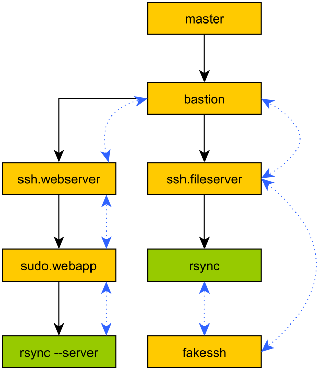

API Reference
*************

Package Layout
==============

mitogen Package
---------------

.. automodule:: mitogen

.. autodata:: mitogen.__version__
.. autodata:: mitogen.is_master
.. autodata:: mitogen.context_id
.. autodata:: mitogen.parent_id
.. autodata:: mitogen.parent_ids
.. autofunction:: mitogen.main

mitogen.core
------------

.. automodule:: mitogen.core

.. currentmodule:: mitogen.core
.. autodecorator:: takes_econtext

.. currentmodule:: mitogen.core
.. autodecorator:: takes_router

mitogen.master
--------------

.. automodule:: mitogen.master

mitogen.parent
--------------

.. automodule:: mitogen.parent

mitogen.fakessh
---------------

.. automodule:: mitogen.fakessh
.. currentmodule:: mitogen.fakessh
.. autofunction:: run (dest, router, args, daedline=None, econtext=None)

Message Class
=============

.. currentmodule:: mitogen.core
.. autoclass:: Message
    :members:

Router Class
============

.. currentmodule:: mitogen.core
.. autoclass:: Router
    :members:

.. currentmodule:: mitogen.parent
.. autoclass:: Router
   :members:

.. currentmodule:: mitogen.master
.. autoclass:: Router (broker=None)
   :members:

.. _context-factories:

Connection Methods
==================

.. currentmodule:: mitogen.parent
.. method:: Router.buildah (container=None, buildah_path=None, username=None, \**kwargs)

    Construct a context on the local machine over a ``buildah`` invocation.
    Accepts all parameters accepted by :meth:`local`, in addition to:

    :param str container:
        The name of the Buildah container to connect to.
    :param str buildah_path:
        Filename or complete path to the ``buildah`` binary. ``PATH`` will be
        searched if given as a filename. Defaults to ``buildah``.
    :param str username:
        Username to use, defaults to unset.

.. currentmodule:: mitogen.parent
.. method:: Router.fork (on_fork=None, on_start=None, debug=False, profiling=False, via=None)

    Construct a context on the local machine by forking the current
    process. The forked child receives a new identity, sets up a new broker
    and router, and responds to function calls identically to children
    created using other methods.

    The use of this method is strongly discouraged. It requires Python 2.6 or
    newer, as older Pythons made no effort to reset threading state upon fork.

    For long-lived processes, :meth:`local` is always better as it
    guarantees a pristine interpreter state that inherited little from the
    parent. Forking should only be used in performance-sensitive scenarios
    where short-lived children must be spawned to isolate potentially buggy
    code, and only after accounting for all the bad things possible as a
    result of, at a minimum:

    * Files open in the parent remaining open in the child,
      causing the lifetime of the underlying object to be extended
      indefinitely.

      * From the perspective of external components, this is observable
        in the form of pipes and sockets that are never closed, which may
        break anything relying on closure to signal protocol termination.

      * Descriptors that reference temporary files will not have their disk
        space reclaimed until the child exits.

    * Third party package state, such as urllib3's HTTP connection pool,
      attempting to write to file descriptors shared with the parent,
      causing random failures in both parent and child.

    * UNIX signal handlers installed in the parent process remaining active
      in the child, despite associated resources, such as service threads,
      child processes, resource usage counters or process timers becoming
      absent or reset in the child.

    * Library code that makes assumptions about the process ID remaining
      unchanged, for example to implement inter-process locking, or to
      generate file names.

    * Anonymous ``MAP_PRIVATE`` memory mappings whose storage requirement
      doubles as either parent or child dirties their pages.

    * File-backed memory mappings that cannot have their space freed on
      disk due to the mapping living on in the child.

    * Difficult to diagnose memory usage and latency spikes due to object
      graphs becoming unreferenced in either parent or child, causing
      immediate copy-on-write to large portions of the process heap.

    * Locks held in the parent causing random deadlocks in the child, such
      as when another thread emits a log entry via the :mod:`logging`
      package concurrent to another thread calling :meth:`fork`, or when a C
      extension module calls the C library allocator, or when a thread is using
      the C library DNS resolver, for example via :func:`socket.gethostbyname`.

    * Objects existing in Thread-Local Storage of every non-:meth:`fork`
      thread becoming permanently inaccessible, and never having their
      object destructors called, including TLS usage by native extension
      code, triggering many new variants of all the issues above.

    * Pseudo-Random Number Generator state that is easily observable by
      network peers to be duplicate, violating requirements of
      cryptographic protocols through one-time state reuse. In the worst
      case, children continually reuse the same state due to repeatedly
      forking from a static parent.

    :meth:`fork` cleans up Mitogen-internal objects, in addition to
    locks held by the :mod:`logging` package, reseeds
    :func:`random.random`, and the OpenSSL PRNG via
    :func:`ssl.RAND_add`, but only if the :mod:`ssl` module is
    already loaded. You must arrange for your program's state, including
    any third party packages in use, to be cleaned up by specifying an
    `on_fork` function.

    The associated stream implementation is
    :class:`mitogen.fork.Stream`.

    :param function on_fork:
        Function invoked as `on_fork()` from within the child process. This
        permits supplying a program-specific cleanup function to break
        locks and close file descriptors belonging to the parent from
        within the child.

    :param function on_start:
        Invoked as `on_start(econtext)` from within the child process after
        it has been set up, but before the function dispatch loop starts.
        This permits supplying a custom child main function that inherits
        rich data structures that cannot normally be passed via a
        serialization.

    :param mitogen.core.Context via:
        Same as the `via` parameter for :meth:`local`.

    :param bool debug:
        Same as the `debug` parameter for :meth:`local`.

    :param bool profiling:
        Same as the `profiling` parameter for :meth:`local`.

.. method:: Router.local (remote_name=None, python_path=None, debug=False, connect_timeout=None, profiling=False, via=None)

    Construct a context on the local machine as a subprocess of the current
    process. The associated stream implementation is
    :class:`mitogen.master.Stream`.

    :param str remote_name:
        The ``argv[0]`` suffix for the new process. If `remote_name` is
        ``test``, the new process ``argv[0]`` will be ``mitogen:test``.

        If unspecified, defaults to ``<username>@<hostname>:<pid>``.

        This variable cannot contain slash characters, as the resulting
        ``argv[0]`` must be presented in such a way as to allow Python to
        determine its installation prefix. This is required to support
        virtualenv.

    :param str|list python_path:
        String or list path to the Python interpreter to use for bootstrap.
        Defaults to :data:`sys.executable` for local connections, and
        ``python`` for remote connections.

        It is possible to pass a list to invoke Python wrapped using
        another tool, such as ``["/usr/bin/env", "python"]``.

    :param bool debug:
        If :data:`True`, arrange for debug logging (:meth:`enable_debug`) to
        be enabled in the new context. Automatically :data:`True` when
        :meth:`enable_debug` has been called, but may be used
        selectively otherwise.

    :param bool unidirectional:
        If :data:`True`, arrange for the child's router to be constructed
        with :attr:`unidirectional routing
        <mitogen.core.Router.unidirectional>` enabled. Automatically
        :data:`True` when it was enabled for this router, but may still be
        explicitly set to :data:`False`.

    :param float connect_timeout:
        Fractional seconds to wait for the subprocess to indicate it is
        healthy. Defaults to 30 seconds.

    :param bool profiling:
        If :data:`True`, arrange for profiling (:data:`profiling`) to be
        enabled in the new context. Automatically :data:`True` when
        :data:`profiling` is :data:`True`, but may be used selectively
        otherwise.

    :param mitogen.core.Context via:
        If not :data:`None`, arrange for construction to occur via RPCs
        made to the context `via`, and for :data:`ADD_ROUTE
        <mitogen.core.ADD_ROUTE>` messages to be generated as appropriate.

        .. code-block:: python

            # SSH to the remote machine.
            remote_machine = router.ssh(hostname='mybox.com')

            # Use the SSH connection to create a sudo connection.
            remote_root = router.sudo(username='root', via=remote_machine)

.. method:: Router.doas (username=None, password=None, doas_path=None, password_prompt=None, incorrect_prompts=None, \**kwargs)

    Construct a context on the local machine over a ``doas`` invocation.
    The ``doas`` process is started in a newly allocated pseudo-terminal,
    and supports typing interactive passwords.

    Accepts all parameters accepted by :meth:`local`, in addition to:

    :param str username:
        Username to use, defaults to ``root``.
    :param str password:
        The account password to use if requested.
    :param str doas_path:
        Filename or complete path to the ``doas`` binary. ``PATH`` will be
        searched if given as a filename. Defaults to ``doas``.
    :param bytes password_prompt:
        A string that indicates ``doas`` is requesting a password. Defaults
        to ``Password:``.
    :param list incorrect_prompts:
        List of bytestrings indicating the password is incorrect. Defaults
        to `(b"doas: authentication failed")`.
    :raises mitogen.doas.PasswordError:
        A password was requested but none was provided, the supplied
        password was incorrect, or the target account did not exist.

.. method:: Router.docker (container=None, image=None, docker_path=None, \**kwargs)

    Construct a context on the local machine within an existing or
    temporary new Docker container using the ``docker`` program. One of
    `container` or `image` must be specified.

    Accepts all parameters accepted by :meth:`local`, in addition to:

    :param str container:
        Existing container to connect to. Defaults to :data:`None`.
    :param str username:
        Username within the container to :func:`setuid` to. Defaults to
        :data:`None`, which Docker interprets as ``root``.
    :param str image:
        Image tag to use to construct a temporary container. Defaults to
        :data:`None`.
    :param str docker_path:
        Filename or complete path to the Docker binary. ``PATH`` will be
        searched if given as a filename. Defaults to ``docker``.

.. method:: Router.jail (container, jexec_path=None, \**kwargs)

    Construct a context on the local machine within a FreeBSD jail using
    the ``jexec`` program.

    Accepts all parameters accepted by :meth:`local`, in addition to:

    :param str container:
        Existing container to connect to. Defaults to :data:`None`.
    :param str username:
        Username within the container to :func:`setuid` to. Defaults to
        :data:`None`, which ``jexec`` interprets as ``root``.
    :param str jexec_path:
        Filename or complete path to the ``jexec`` binary. ``PATH`` will be
        searched if given as a filename. Defaults to ``/usr/sbin/jexec``.

.. method:: Router.kubectl (pod, kubectl_path=None, kubectl_args=None, \**kwargs)

    Construct a context in a container via the Kubernetes ``kubectl``
    program.

    Accepts all parameters accepted by :meth:`local`, in addition to:

    :param str pod:
        Kubernetes pod to connect to.
    :param str kubectl_path:
        Filename or complete path to the ``kubectl`` binary. ``PATH`` will
        be searched if given as a filename. Defaults to ``kubectl``.
    :param list kubectl_args:
        Additional arguments to pass to the ``kubectl`` command.

.. method:: Router.lxc (container, lxc_attach_path=None, \**kwargs)

    Construct a context on the local machine within an LXC classic
    container using the ``lxc-attach`` program.

    Accepts all parameters accepted by :meth:`local`, in addition to:

    :param str container:
        Existing container to connect to. Defaults to :data:`None`.
    :param str lxc_attach_path:
        Filename or complete path to the ``lxc-attach`` binary. ``PATH``
        will be searched if given as a filename. Defaults to
        ``lxc-attach``.

.. method:: Router.lxd (container, lxc_path=None, \**kwargs)

    Construct a context on the local machine within a LXD container using
    the ``lxc`` program.

    Accepts all parameters accepted by :meth:`local`, in addition to:

    :param str container:
        Existing container to connect to. Defaults to :data:`None`.
    :param str lxc_path:
        Filename or complete path to the ``lxc`` binary. ``PATH`` will be
        searched if given as a filename. Defaults to ``lxc``.

.. currentmodule:: mitogen.parent
.. method:: Router.podman (container=None, podman_path=None, username=None, \**kwargs)

    Construct a context on the local machine over a ``podman`` invocation.
    Accepts all parameters accepted by :meth:`local`, in addition to:

    :param str container:
        The name of the Podman container to connect to.
    :param str podman_path:
        Filename or complete path to the ``podman`` binary. ``PATH`` will be
        searched if given as a filename. Defaults to ``podman``.
    :param str username:
        Username to use, defaults to unset.

.. method:: Router.setns (container, kind, username=None, docker_path=None, lxc_info_path=None, machinectl_path=None, \**kwargs)

    Construct a context in the style of :meth:`local`, but change the
    active Linux process namespaces via calls to `setns(2)` before
    executing Python.

    The namespaces to use, and the active root file system are taken from
    the root PID of a running Docker, LXC, LXD, or systemd-nspawn
    container.

    The setns method depends on the built-in :mod:`ctypes` module, and thus
    does not support Python 2.4.

    A program is required only to find the root PID, after which management
    of the child Python interpreter is handled directly.

    :param str container:
        Container to connect to.
    :param str kind:
        One of ``docker``, ``lxc``, ``lxd`` or ``machinectl``.
    :param str username:
        Username within the container to :func:`setuid` to. Defaults to
        ``root``.
    :param str docker_path:
        Filename or complete path to the Docker binary. ``PATH`` will be
        searched if given as a filename. Defaults to ``docker``.
    :param str lxc_path:
        Filename or complete path to the LXD ``lxc`` binary. ``PATH`` will
        be searched if given as a filename. Defaults to ``lxc``.
    :param str lxc_info_path:
        Filename or complete path to the LXC ``lxc-info`` binary. ``PATH``
        will be searched if given as a filename. Defaults to ``lxc-info``.
    :param str machinectl_path:
        Filename or complete path to the ``machinectl`` binary. ``PATH``
        will be searched if given as a filename. Defaults to
        ``machinectl``.

.. method:: Router.su (username=None, password=None, su_path=None, password_prompt=None, incorrect_prompts=None, \**kwargs)

    Construct a context on the local machine over a ``su`` invocation. The
    ``su`` process is started in a newly allocated pseudo-terminal, and
    supports typing interactive passwords.

    Accepts all parameters accepted by :meth:`local`, in addition to:

    :param str username:
        Username to pass to ``su``, defaults to ``root``.
    :param str password:
        The account password to use if requested.
    :param str su_path:
        Filename or complete path to the ``su`` binary. ``PATH`` will be
        searched if given as a filename. Defaults to ``su``.
    :param bytes password_prompt:
        The string that indicates ``su`` is requesting a password. Defaults
        to ``Password:``.
    :param str incorrect_prompts:
        Strings that signal the password is incorrect. Defaults to `("su:
        sorry", "su: authentication failure")`.

    :raises mitogen.su.PasswordError:
        A password was requested but none was provided, the supplied
        password was incorrect, or (on BSD) the target account did not
        exist.

.. method:: Router.sudo (username=None, sudo_path=None, password=None, \**kwargs)

    Construct a context on the local machine over a ``sudo`` invocation.
    The ``sudo`` process is started in a newly allocated pseudo-terminal,
    and supports typing interactive passwords.

    Accepts all parameters accepted by :meth:`local`, in addition to:

    :param str username:
        Username to pass to sudo as the ``-u`` parameter, defaults to
        ``root``.
    :param str sudo_path:
        Filename or complete path to the sudo binary. ``PATH`` will be
        searched if given as a filename. Defaults to ``sudo``.
    :param str password:
        The password to use if/when sudo requests it. Depending on the sudo
        configuration, this is either the current account password or the
        target account password. :class:`mitogen.sudo.PasswordError`
        will be raised if sudo requests a password but none is provided.
    :param bool set_home:
        If :data:`True`, request ``sudo`` set the ``HOME`` environment
        variable to match the target UNIX account.
    :param bool preserve_env:
        If :data:`True`, request ``sudo`` to preserve the environment of
        the parent process.
    :param str selinux_type:
        If not :data:`None`, the SELinux security context to use.
    :param str selinux_role:
        If not :data:`None`, the SELinux role to use.
    :param list sudo_args:
        Arguments in the style of :data:`sys.argv` that would normally
        be passed to ``sudo``. The arguments are parsed in-process to set
        equivalent parameters. Re-parsing ensures unsupported options cause
        :class:`mitogen.core.StreamError` to be raised, and that
        attributes of the stream match the actual behaviour of ``sudo``.

.. method:: Router.ssh (hostname, username=None, ssh_path=None, ssh_args=None, port=None, check_host_keys='enforce', password=None, identity_file=None, identities_only=True, compression=True, \**kwargs)

    Construct a remote context over an OpenSSH ``ssh`` invocation.

    The ``ssh`` process is started in a newly allocated pseudo-terminal to
    support typing interactive passwords and responding to prompts, if a
    password is specified, or `check_host_keys=accept`. In other scenarios,
    ``BatchMode`` is enabled and no PTY is allocated. For many-target
    configurations, both options should be avoided as most systems have a
    conservative limit on the number of pseudo-terminals that may exist.

    Accepts all parameters accepted by :meth:`local`, in addition to:

    :param str username:
        The SSH username; default is unspecified, which causes SSH to pick
        the username to use.
    :param str ssh_path:
        Absolute or relative path to ``ssh``. Defaults to ``ssh``.
    :param list ssh_args:
        Additional arguments to pass to the SSH command.
    :param int port:
        Port number to connect to; default is unspecified, which causes SSH
        to pick the port number.
    :param str check_host_keys:
        Specifies the SSH host key checking mode. Defaults to ``enforce``.

        * ``ignore``: no host key checking is performed. Connections never
          fail due to an unknown or changed host key.
        * ``accept``: known hosts keys are checked to ensure they match,
          new host keys are automatically accepted and verified in future
          connections.
        * ``enforce``: known host keys are checked to ensure they match,
          unknown hosts cause a connection failure.
    :param str password:
        Password to type if/when ``ssh`` requests it. If not specified and
        a password is requested, :class:`mitogen.ssh.PasswordError` is
        raised.
    :param str identity_file:
        Path to an SSH private key file to use for authentication. Default
        is unspecified, which causes SSH to pick the identity file.

        When this option is specified, only `identity_file` will be used by
        the SSH client to perform authenticaion; agent authentication is
        automatically disabled, as is reading the default private key from
        ``~/.ssh/id_rsa``, or ``~/.ssh/id_dsa``.
    :param bool identities_only:
        If :data:`True` and a password or explicit identity file is
        specified, instruct the SSH client to disable any authentication
        identities inherited from the surrounding environment, such as
        those loaded in any running ``ssh-agent``, or default key files
        present in ``~/.ssh``. This ensures authentication attempts only
        occur using the supplied password or SSH key.
    :param bool compression:
        If :data:`True`, enable ``ssh`` compression support. Compression
        has a minimal effect on the size of modules transmitted, as they
        are already compressed, however it has a large effect on every
        remaining message in the otherwise uncompressed stream protocol,
        such as function call arguments and return values.
    :param int ssh_debug_level:
        Optional integer `0..3` indicating the SSH client debug level.
    :raises mitogen.ssh.PasswordError:
        A password was requested but none was specified, or the specified
        password was incorrect.

    :raises mitogen.ssh.HostKeyError:
        When `check_host_keys` is set to either ``accept``, indicates a
        previously recorded key no longer matches the remote machine. When
        set to ``enforce``, as above, but additionally indicates no
        previously recorded key exists for the remote machine.

Context Class
=============

.. currentmodule:: mitogen.core
.. autoclass:: Context
    :members:

.. currentmodule:: mitogen.parent
.. autoclass:: Context
    :members:

.. currentmodule:: mitogen.parent
.. autoclass:: CallChain
    :members:

Receiver Class
==============

.. currentmodule:: mitogen.core
.. autoclass:: Receiver
    :members:

Sender Class
============

.. currentmodule:: mitogen.core
.. autoclass:: Sender
    :members:

Select Class
============

.. module:: mitogen.select
.. currentmodule:: mitogen.select

.. autoclass:: Event
    :members:

.. autoclass:: Select
    :members:

Channel Class
=============

.. currentmodule:: mitogen.core
.. autoclass:: Channel
   :members:

Broker Class
============

.. currentmodule:: mitogen.core
.. autoclass:: Broker
   :members:

.. currentmodule:: mitogen.master
.. autoclass:: Broker
   :members:

Fork Safety
===========

.. currentmodule:: mitogen.os_fork
.. autoclass:: Corker
   :members:

Utility Functions
=================

.. currentmodule:: mitogen.core
.. function:: now

   A reference to :func:`time.time` on Python 2, or :func:`time.monotonic` on
   Python >3.3. We prefer :func:`time.monotonic` when available to ensure
   timers are not impacted by system clock changes.

.. module:: mitogen.utils

A random assortment of utility functions useful on masters and children.

.. currentmodule:: mitogen.utils
.. autofunction:: cast

.. currentmodule:: mitogen.utils
.. autofunction:: setup_gil
.. autofunction:: disable_site_packages
.. autofunction:: log_to_file
.. autofunction:: run_with_router(func, \*args, \**kwargs)

.. currentmodule:: mitogen.utils
.. decorator:: with_router

    Decorator version of :func:`run_with_router`. Example:

    .. code-block:: python

        @with_router
        def do_stuff(router, arg):
            pass

        do_stuff(blah, 123)

Exceptions
==========

.. currentmodule:: mitogen.core

.. autoclass:: Error
.. autoclass:: CallError
.. autoclass:: ChannelError
.. autoclass:: LatchError
.. autoclass:: StreamError
.. autoclass:: TimeoutError

.. currentmodule:: mitogen.parent
.. autoclass:: EofError
.. autoclass:: CancelledError
